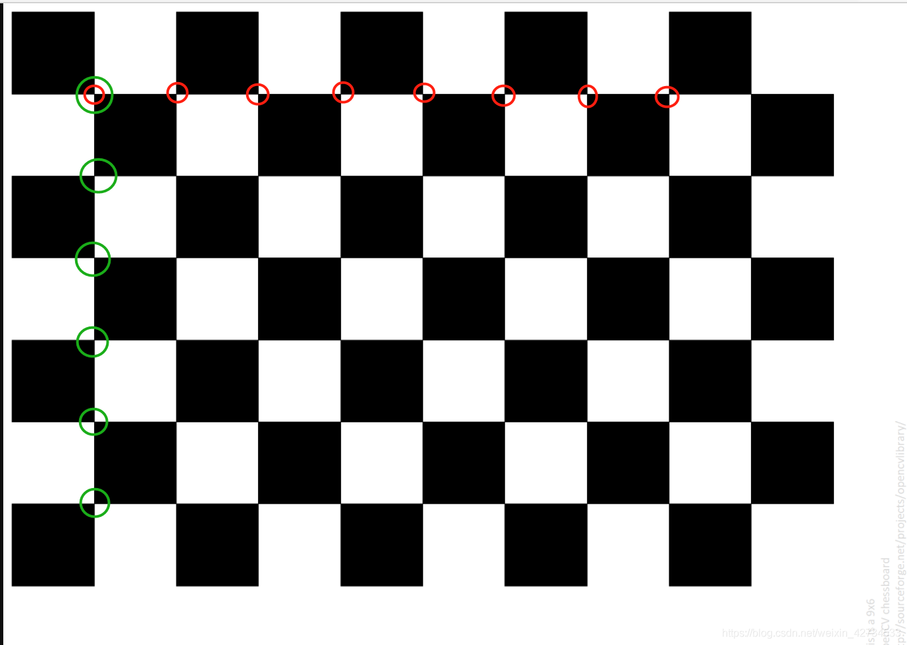

# 移动机器人控制 ROS2

基于 Jetson Nano

## 准备工作

### 摄像头畸变矫正

使用 [Opencv 官方棋盘格](https://docs.opencv.org/2.4/_downloads/pattern.png) 进行相机标定

得出标定板的内部行列交点个数 `6 * 9`



`camera-distortion-correction.py`


## 功能包
### 视频流 cpp_video_streamer

包含两个节点 
- 读取视频节点 `node_video_reader`
- 显示视频节点 `node_video_viewer`

#### 读取视频节点 node_video_reader
参数
- `source`: 视频源，可选择如下
  - `camera`: 默认，从摄像头读取
  - `<file/url>`:  文件名或者网络url
#### 显示视频节点 node_video_viewer


## 常见问题和解决方案


#### Jetson Nano 上串口权限问题
```shell
could not open port /dev/ttyUSB0: [Errno 13] Permission denied: '/dev/ttyUSB0
```
把自己的用户加入到dialout组
```shell
sudo usermod -aG dialout ${USER}  # user 替换为自己的用户名
reboot							              # 必须要重启一下才会生效
```