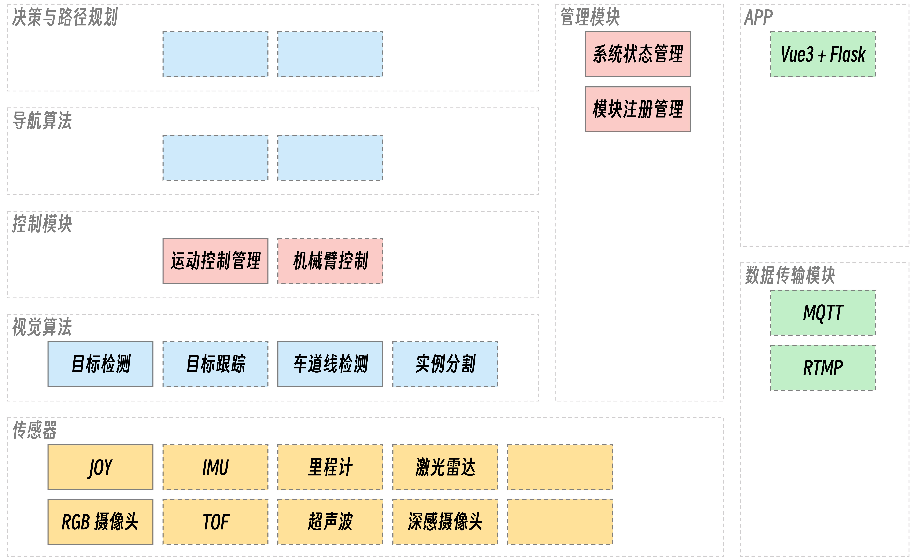

# 移动机器人开发文档

## 项目结构

该项目的 ROS2 工作空间 `modules` ，功能结构分组及其所包含的功能包如下:
- **common**: 通用功能模块。包括全局的系统状态码定义、通用的工具函数等
  - system_state: 系统状态码和错误码的全局定义
  - utils: 通用工具函数 (未开发)
- **interfaces**: 数据接口定义。包括各个模块之间的数据接口、消息结构定义
- **controller**: 控制模块。包括底盘控制、机械臂控制等
  - [motion_manager](./modules/controller/motion_manager.md): 运动控制模块
- **manager**: 管理模块。包括系统状态管理、任务管理等
- **data_transmission**: 数据传输模块。包括串口通信、网络通信等
  - [dt_mqtt](./modules/data_transmission/dt_mqtt.md): MQTT 通信模块
  - [dt_rtmp](./modules/data_transmission/dt_rtmp.md): 视频推流模块，RTMP 协议
- **sensors**: 传感器模块。包括各种传感器的驱动、数据处理等
- **vision**: 视觉算法模块。包括各种视觉算法的实现
- **navigation**: 导航模块 (未开发)
- **app**: 应用程序
- **launch**: ROS2 启动文件



## 分支管理

项目使用 git 进行版本控制，每个功能模块都应该新建一个分支进行开发，开发完成后合并到 `dev` 分支，`dev` 分支的代码经过测试后 PR 到 `main` 分支。根据系统架构中功能模块的重要程度不同，有两种分支命名规则：

1. **核心模块命名规则**

  核心模块是整个系统的运行的基础，因此核心模块的分支应该为 `core-<group>` 结构，`<group>` 为功能分组，并且不再进行子模块分组，核心模块包括：
  - `core-manager`: 包括 数据接口 (interfaces) 、 系统管理 (manager) 和 启动文件 (launch) 
  - `core-common` 通用功能包 (common)

1. **功能模块命名规则**

  其他子模块的开发和测试是完全可以独立的，因此，其他功能包的分支应该为 `pkg-<group>__<package_name>` 结构，`<group>` 为功能分组，`<package_name>` 为功能包名，中间用双下划线 `__` 分隔。

  例如，控制模块 (controller) 中运动控制 (motion_manager) 的分支应该为 `pkg-controller__motion_manager` 

## 项目文档

项目文档也按照功能分组，放置在 `docs/modules` 中 ，启动项目的文档命令：
```shell
yarn
yarn docs:dev
```

pkg-sensors__joy