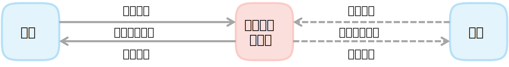

# 基本节点 (base_node)

基本节点 `BaseNode` 是所有节点的基类，提供了节点的基本功能，包括：
- 节点定义
- 心跳机制

## 基本节点的功能

### 节点定义

节点定义包括节点的初始化、节点设置、心跳设置

节点设置指的是设置注册序号，包括分组 (state_group) 和序号 (state_group) ，分组用于区分不同的功能模块，序号用于区分不同的节点。
分组参考 `SystemStateGroup` ，序号参考 `SystemStateCode` 。

### 心跳机制

为了能够监测各个节点的运行状态，基本节点提供了心跳机制。

- 在节点启动时，「当前节点」会向「系统状态管理器」注册自己的心跳包，「系统状态管理器」会为「当前节点」分配一个注册序号，「当前节点」会使用这个注册序号来标识自己，如果节点的注册序号为 `0`，则不会继续运行节点相关功能
- 在节点运行时，「当前节点」定时向「系统状态管理器」发送心跳包，以表明「当前节点」的运行状态。「系统状态管理器」会不断广播系统的运行状态，以便其他节点能够获取到系统的运行状态。

**异常监测**：「系统状态管理器」根据收到的心跳包判断节点是否正常运行，如果节点长时间没有发送心跳包，则认为节点已经停止运行，将节点的状态码设置为 `OFFLINE`，则其他依赖于「当前节点」数据的节点则不再执行相关操作，同时也便于检查哪些节点已经停止运行。

总的来说，心跳机制，是为了让系统状态管理器获取到各个节点的运行状态，以便于快速定位到系统中的异常节点，从而提高系统的可靠性。